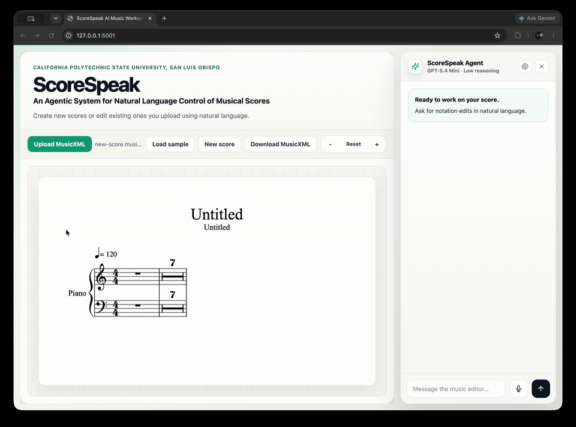

# ScoreSpeak: An Agentic System for Natural Language Control of Musical Scores

ScoreSpeak is a comprehensive LLM-based agentic system that enables full natural language control of musical scores as MusicXML files. With over 80 score editing tools available to the agent, ScoreSpeak supports both the creation and precise editing of virtually every aspect of a score, including notation, instrumentation, articulations, dynamics, expressions, and advanced structural layouts.

## Demo



This public repository contains:

- `scorespeak/`: the score editing framework, retrieval helpers, agent tools,
  LangGraph agent loop, and voice transcription adapter.
- `web/`: the main browser editor for rendering MusicXML and editing scores
  through ScoreSpeak chat and voice input.
- `datasets/`: public benchmark data from the ScoreSpeak thesis evaluation.
- `tests/`: framework, agent, web, and dataset tests.

## Installation

Use Python 3.10 or newer.

```bash
python -m venv .venv
source .venv/bin/activate
pip install -e ".[dev]"
```

Set an OpenAI API key before using the agent or voice transcription features:

```bash
export OPENAI_API_KEY="..."
```

The core framework can still be imported without an API key for deterministic
MusicXML editing and dataset utilities.

## Running Tests

```bash
pytest
```

## Running The Web Editor

```bash
python web/server.py
```

Then open `http://localhost:5001`. The editor supports MusicXML upload,
new-score creation, OSMD rendering, chat-based editing, voice input, and
MusicXML export.

## Public Datasets

Dataset source and rights notes are documented in `datasets/ATTRIBUTIONS.md`,
with file-level provenance in `datasets/sources.csv`.

`datasets/precise_edit/cases.csv` contains the final 752 validated precise-edit
benchmark cases. It has only public fields:

- `public_case_id`
- `base_score_id`
- `base_musicxml_path`
- `prompt`
- `expected_edit_actions_json`
- `tags_json`
- `difficulty`

The referenced base scores are copied into `datasets/scores/`.

The expected edit actions can be replayed directly through the public
benchmark action runner. These actions are the precise-edit benchmark contract
and are intentionally separate from the agent-visible ScoreSpeak tools so that
modifications can be made to the tools without breaking the benchmark contract:

```python
from scorespeak.evaluation import apply_precise_edit_case, load_precise_edit_cases

cases = load_precise_edit_cases("datasets/precise_edit/cases.csv")
score_state, results = apply_precise_edit_case(cases[0], repository_root=".")
score_state.to_musicxml("edited.musicxml")
```

`datasets/long_task_reconstruction/` contains the six thesis long-task
reconstruction cases:

- `manifest.json`: public case inventory and file references.
- `prompts/<case_id>.txt`: exact thesis evaluation prompts.
- `sources/*.musicxml`: source/base MusicXML files.
- `targets/*.musicxml`: target MusicXML files.

The long-task manifest includes only public fields: `case_id`, `title`,
`source_musicxml_path`, `target_musicxml_path`, `prompt_path`, `tags`, and
`difficulty`.

## Symbolic Fact Extraction

The long-task benchmark uses deterministic symbolic fact extraction for
MusicXML comparison. The public extractor is available at:

```python
from scorespeak.evaluation import extract_long_task_facts

result = extract_long_task_facts(
    "datasets/long_task_reconstruction/targets/mozart_k545_bars001_012.musicxml"
)
print(result.target_fact_count_supported)
```

The extractor is independent of the deleted benchmark generation and evaluation
pipeline code.
